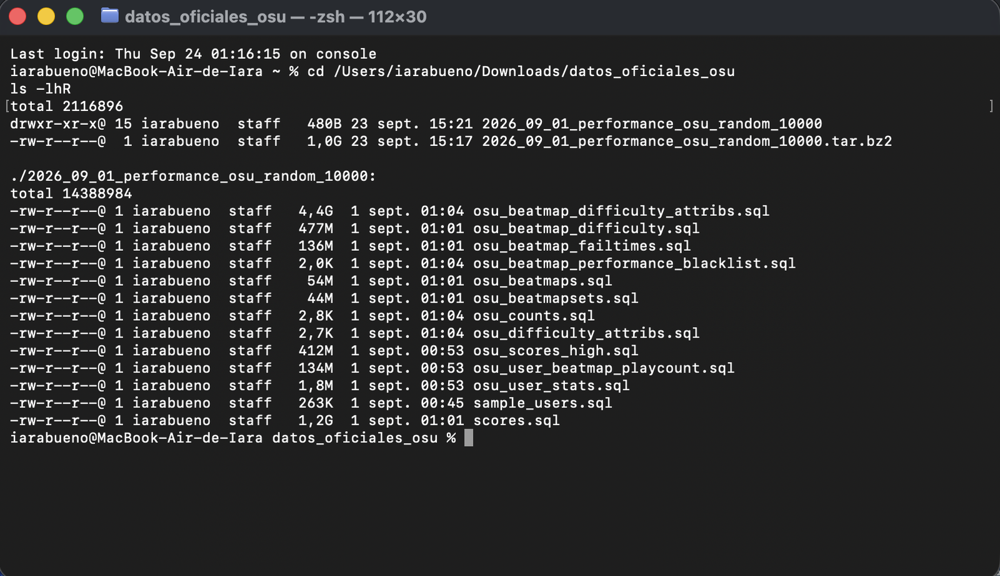
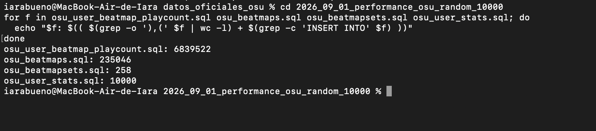
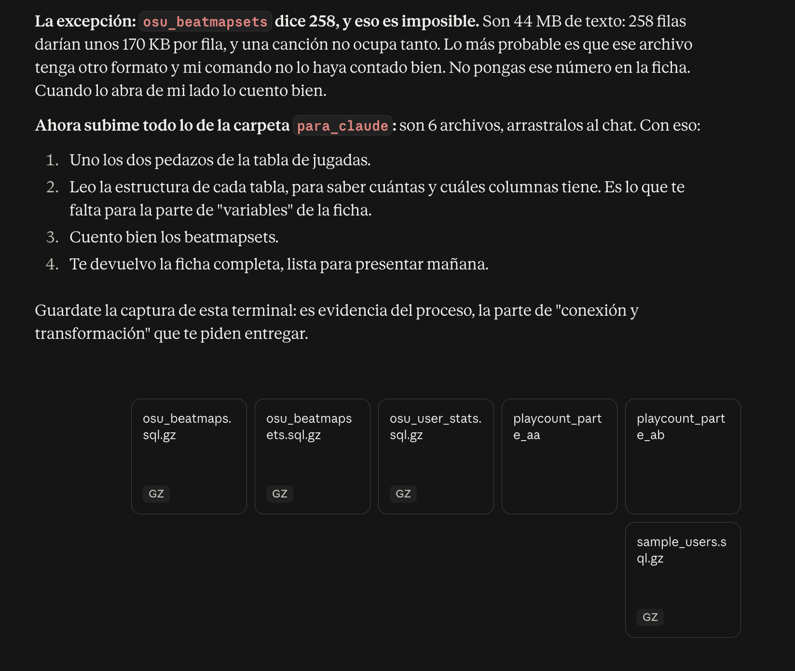
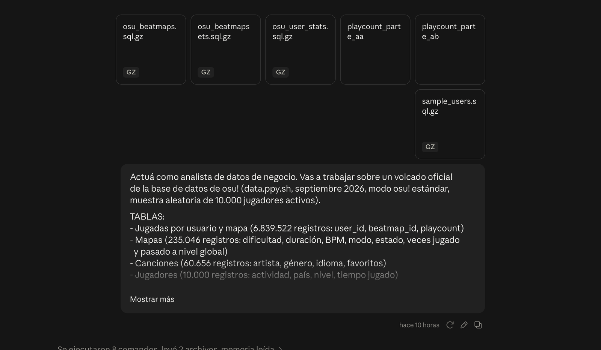
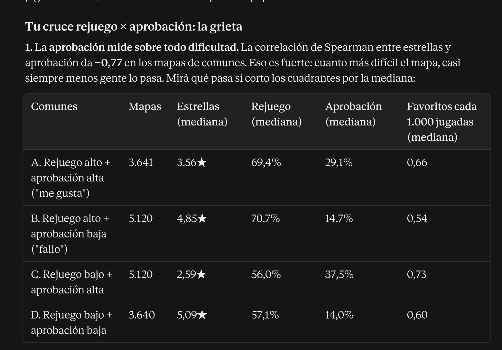
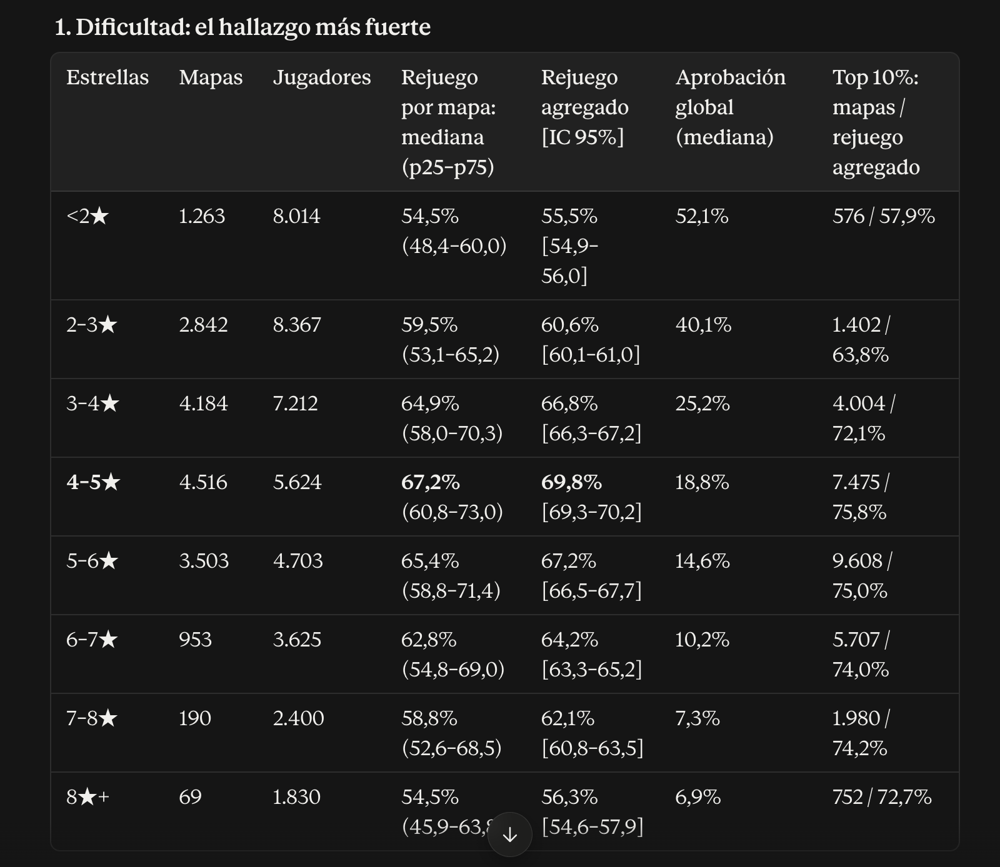
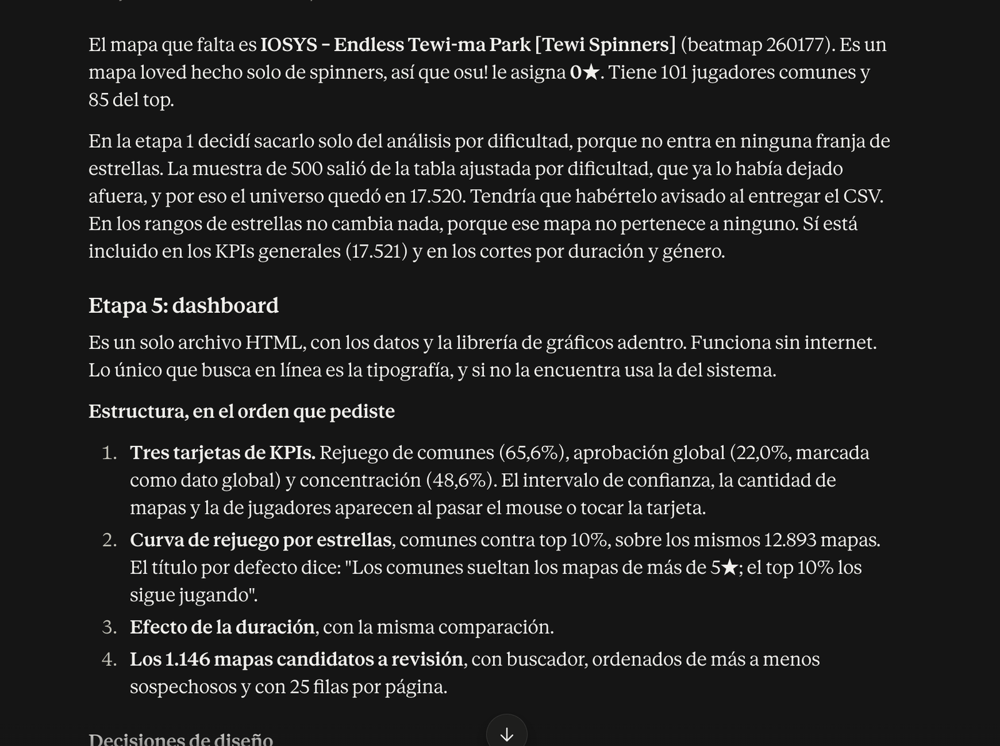
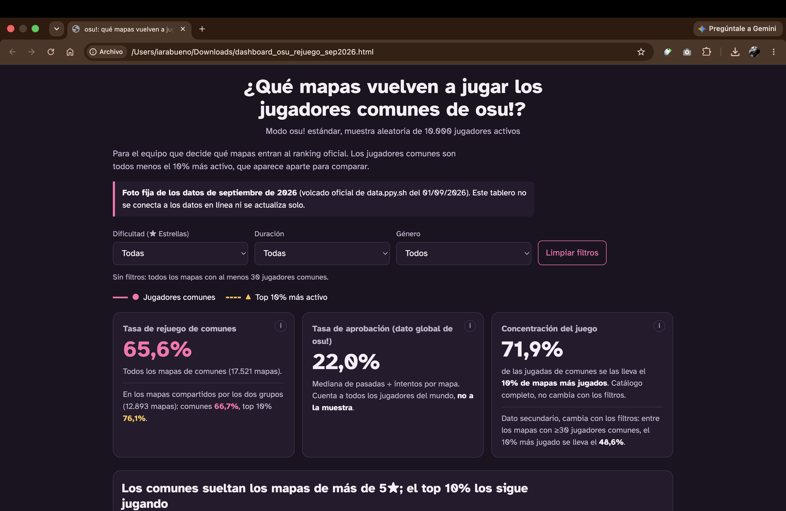
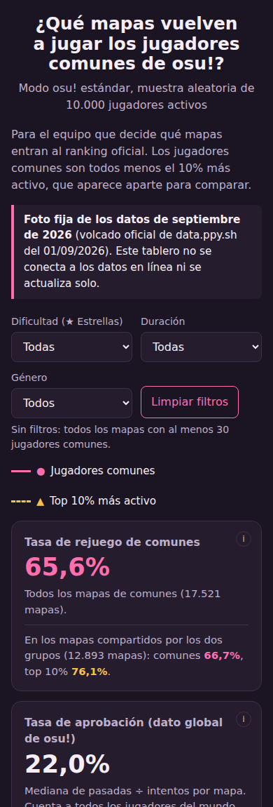
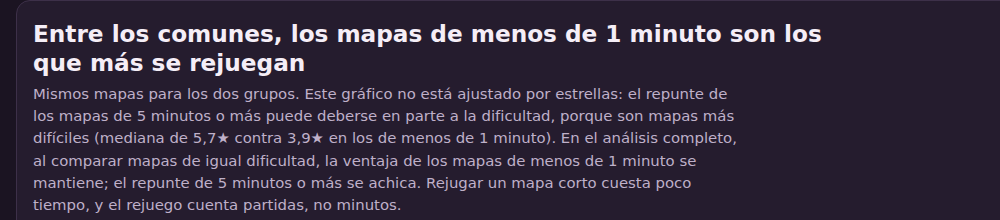

# Evidencia del proceso

**osu!: ¿qué mapas hacen volver a los jugadores?**
Iara Lourdes Bueno · Big Data Analytics · Desafío individual optativo (Opción 3: Claude y análisis de datos) · Septiembre 2026

Este documento muestra el recorrido completo del trabajo siguiendo CRISP-DM: la conexión con los datos, su transformación, la exploración, la validación humana de los hallazgos y el resultado final. Cada figura indica qué muestra y en qué etapa se obtuvo.

- **Conversación compartida (análisis, dashboard e informe):** https://claude.ai/share/b302c03a-3173-4cd0-91ab-83719306adbd
- **Dashboard:** archivo HTML único en la carpeta [`docs/`](../docs/). Es una foto fija de los datos y no se conecta en línea.

---

## Ficha de propuesta

| | |
|---|---|
| **Dataset y fuente** | Volcado oficial de la base de datos de osu! (ppy Pty Ltd., [data.ppy.sh](https://data.ppy.sh)), modo osu! estándar, muestra aleatoria de 10.000 jugadores activos, septiembre 2026. |
| **Registros y variables** | Tabla principal de 6.839.522 registros (jugadas por jugador y mapa, 3 variables), integrada con 235.046 mapas (29 variables), 60.656 canciones (54 variables) y 10.000 jugadores (29 variables). |
| **Pregunta de negocio** | Para el equipo que decide qué mapas entran al ranking oficial, ¿qué características de un mapa (dificultad, duración, ritmo, género) hacen que los jugadores comunes lo vuelvan a jugar en lugar de abandonarlo? |
| **Opción tecnológica** | Opción 3, Claude y análisis de datos. |
| **Resultado esperado** | Dashboard interactivo en HTML con KPIs de tasa de rejuego, tasa de aprobación y concentración del juego, segmentados por tipo de mapa, y recomendaciones para priorizar mapas en el ranking. |

---

## 1. Comprensión de los datos: conexión

La fuente es el volcado oficial de la base de datos de osu! publicado por sus desarrolladores en data.ppy.sh. Se eligió la muestra aleatoria de 10.000 jugadores del modo estándar (`2026_09_01_performance_osu_random_10000`), en lugar de la de los 10.000 mejores, para evitar el sesgo de supervivencia.


*Figura 1. Contenido del volcado descargado: 13 tablas en formato SQL. Comandos re-ejecutados el 24/09/2026 para esta captura; los archivos son los descargados el 23/09/2026.*


*Figura 2. Conteo de registros desde la terminal: 6.839.522 jugadas por jugador y mapa, 235.046 mapas y 10.000 jugadores. El valor de 258 para las canciones (beatmapsets) es un error del método de conteo, detectado y corregido en la etapa siguiente.*

## 2. Preparación de los datos: transformación


*Figura 3. Detección de la anomalía: 44 MB de texto no pueden corresponder a 258 filas. Se descartó ese número para la ficha y, al convertir las tablas SQL con código, el conteo real resultó ser 60.656 canciones.*


*Figura 4. Carga de las tablas comprimidas en el chat de análisis junto con el prompt maestro, que ya incluye los conteos verificados.*

**Embudo de filtros aplicado en la preparación** (transcripción de la etapa 1 del chat de análisis):

| Paso | Mapas | Filas de jugadas |
|---|---:|---:|
| Volcado completo | 235.046 | 6.839.522 |
| Solo modo osu! estándar | 152.342 | 6.289.359 |
| Sin mapas "qualified" (aún no oficiales) | 152.153 | 6.289.216 |
| Con al menos una jugada en la muestra | 148.713 | 6.289.216 |
| Con al menos 30 jugadores comunes | 17.521 | — |

Además se verificó que no hay duplicados ni nulos en las columnas usadas y que todas las jugadas apuntan a mapas y jugadores existentes.

## 3. Análisis: exploración


*Figura 5. Etapa 2: al cruzar rejuego con aprobación (cruce propuesto por mí), el análisis mostró que la aprobación mide sobre todo la dificultad (correlación de Spearman −0,77). A partir de esto se ajustó la aprobación por franja de estrellas.*


*Figura 6. Etapa 3: rejuego por dificultad. En los jugadores comunes el rejuego sube hasta un pico en 4–5★ (69,8%) y después baja; el top 10% se mantiene alto.*

## 4. Evaluación: validación humana

Los números clave se recalcularon por separado en planillas de cálculo, a partir de dos archivos exportados del análisis. Las planillas están en la carpeta [`validacion/`](../validacion/).

### Validación 1: tasa de rejuego de un mapa puntual

Mapa: Getter Jaani – Rockefeller Street [Lasse's Insane].


*Figura 7. Datos del mapa en la planilla: una fila por jugador, con la cantidad de veces que lo jugó y su grupo.*

| Cálculo propio en la planilla | Resultado | Valor del análisis |
|---|---:|---:|
| Jugadores comunes | 475 | 475 |
| Comunes que lo rejugaron (2 veces o más) | 366 | 366 |
| Tasa de rejuego de comunes | 77,05% | 77,1% |
| Top 10% que lo rejugó | 311 de 405 | 311 de 405 |
| Tasa de rejuego del top 10% | 76,79% | 76,8% |

### Validación 2: curva de rejuego por estrellas en una muestra aleatoria de 500 mapas


*Figura 8. Muestra de 500 mapas con la franja de estrellas calculada con una fórmula propia (columna I).*

| Franja | Mapas | Rejuego (planilla) |
|---|---:|---:|
| <2★ | 29 | 56,1% |
| 2–3★ | 83 | 59,5% |
| 3–4★ | 112 | 67,7% |
| 4–5★ | 126 | 70,1% |
| 5–6★ | 116 | 65,6% |
| 6–7★ | 28 | 60,0% |
| 7–8★ | 3 | 55,7% |
| 8★ o más | 3 | 69,1% |


*Figura 9. Gráfico propio: se repite la U invertida con el pico en 4–5★. Las franjas de 7–8★ y 8★ o más tienen solo 3 mapas cada una y no son concluyentes; una muestra de 500 mapas reproduce el centro de la curva, pero no alcanza para los extremos.*


*Figura 10. Discrepancia detectada durante la revisión: la muestra salía de 17.520 mapas y no de 17.521. El análisis había excluido un mapa de 0★ sin informarlo.*

### Otras correcciones surgidas de la revisión humana

- La tarjeta de concentración del dashboard mostraba 48,6%, un valor que el propio análisis había descartado como KPI; se corrigió a 71,9%.
- Dos porcentajes del informe (70% de mapas y 77% de jugadas) no habían pasado por validación; se pidió su cálculo y se verificó que cierran con los totales ya validados.
- Se ajustó el título del gráfico de duración, que generalizaba más de lo que mostraban los datos (figuras 13 y 14).

## 5. Despliegue: resultado final


*Figura 11. Dashboard final en la computadora: título, aviso de foto fija de septiembre de 2026, filtros y tarjetas de KPIs.*



*Figura 12. Vista del dashboard en pantalla de celular.*


*Figura 13. Antes de la revisión: el título del gráfico de duración generalizaba a todos los jugadores.*


*Figura 14. Después de la revisión: el título se limita a los jugadores comunes y aclara que el repunte de los mapas de 5 minutos o más puede deberse a la dificultad.*

## 6. Prompt utilizado

Prompt diseñado para la etapa de análisis, pegado sin cambios al inicio del chat de análisis. También está en [`prompt/prompt_maestro.md`](../prompt/prompt_maestro.md).

```
Actuá como analista de datos de negocio. Vas a trabajar sobre un volcado oficial
de la base de datos de osu! (data.ppy.sh, septiembre 2026, modo osu! estándar,
muestra aleatoria de 10.000 jugadores activos).

TABLAS:
- Jugadas por usuario y mapa (6.839.522 registros: user_id, beatmap_id, playcount)
- Mapas (235.046 registros: dificultad, duración, BPM, modo, estado, veces jugado
  y pasado a nivel global)
- Canciones (60.656 registros: artista, género, idioma, favoritos)
- Jugadores (10.000 registros: actividad, país, nivel, tiempo jugado)

ARCHIVOS ADJUNTOS:
Son tablas del volcado original en formato SQL (MySQL), comprimidas con gzip.
La tabla de jugadas está partida en dos: playcount_parte_aa y playcount_parte_ab.
Unilas en ese orden antes de descomprimir. Convertí todo a tablas y confirmá
la cantidad de registros de cada una antes de empezar el análisis.

PREGUNTA DE NEGOCIO:
Para el equipo que decide qué mapas entran al ranking oficial, ¿qué características
de un mapa hacen que los jugadores comunes lo vuelvan a jugar en lugar de abandonarlo?

DEFINICIONES:
- Abandono: el jugador jugó el mapa una sola vez y no volvió.
- Rejuego: el jugador jugó el mapa dos veces o más.
- Jugadores comunes: excluí al 10% más activo de la muestra (según su cantidad
  total de jugadas) y mostrá los resultados de ese 10% aparte, como comparación.
- Solo considerá mapas jugados por al menos 30 jugadores de la muestra.

TAREAS (seguí CRISP-DM):
1. Preparación: filtrá solo mapas del modo osu! estándar, detectá nulos, duplicados
   y valores extremos, y explicá cada decisión de limpieza.
2. KPIs:
   - Tasa de rejuego: % de jugadores de la muestra que jugaron el mapa más de una vez.
   - Tasa de aprobación: pasadas / intentos del mapa (dato global de osu!, no de
     la muestra; aclaralo siempre que lo uses).
   - Concentración del juego: qué % de las jugadas se lleva el top 10% de los mapas.
3. Análisis: compará esos KPIs por rangos de dificultad, duración, BPM, género y
   estado del mapa (rankeado o loved). Los géneros e idiomas vienen como códigos
   numéricos: no inventes sus nombres; si no tenés la equivalencia oficial, pedímela.
4. Validación: para cada hallazgo, mostrame el número exacto y cómo calcularlo, para
   que yo lo verifique por mi cuenta en Google Sheets con una muestra.
5. Dashboard: un archivo HTML único e interactivo con los KPIs y filtros por
   dificultad, duración y género, que aclare que es una foto de los datos de
   septiembre 2026 y no se actualiza sola.
6. Informe ejecutivo: borrador de máximo 2 páginas con estas secciones:
   contexto y problema de negocio; fuente, calidad y preparación de datos;
   KPIs utilizados; 3 hallazgos principales; 3 recomendaciones accionables;
   limitaciones, sesgos y riesgos.

ESTADÍSTICA DESCRIPTIVA:
- Las distribuciones de jugadas están muy sesgadas: usá mediana y percentiles
  (25, 75, 90) como medidas principales. Mostrá la media solo como comparación,
  explicando por qué difiere de la mediana.
- En cada comparación entre grupos, indicá cuántos mapas y jugadores hay en
  cada grupo.
- Para las tasas por grupo, calculá intervalos de confianza del 95% y decime
  si las diferencias entre grupos son claras o podrían ser casualidad.
- Para relaciones entre variables, usá correlación de Spearman y explicá en
  palabras simples qué significa cada resultado.

FORMA DE TRABAJO:
- Hacé una etapa por vez y frená al terminar cada una para que yo la revise
  antes de seguir.

REGLAS:
- No inventes datos ni completes con supuestos: si algo no se puede responder
  con estas tablas, decilo.
- Distinguí correlación de causalidad.
- Nombrá los sesgos de la muestra (solo jugadores activos, solo mapas oficiales).
- Usá lenguaje simple, sin jerga técnica innecesaria.
```

## 7. Reflexión: IA generativa frente a BI tradicional

**Aportes.** La IA me sirvió bastante porque los datos tenían 6,8 millones de filas, y me acortó mucho el trabajo de procesarlos. Aunque fue un trabajo largo, me permitió ser más eficiente con los archivos.

**Límites.** La IA puede no darse cuenta por sí sola de ciertas cosas, y hay que aclararle algunos puntos que no puede deducir.

**Diferencias con BI tradicional.** No siento que haya sido más rápido. Si bien fue eficiente, pasé bastantes horas armando el prompt correcto y verificando qué estaba haciendo la IA. Lo más difícil fue conseguir y preparar las tablas, y lo que más disfruté fue armar el dashboard. La comprobación de los números en Excel la hice como control, para verificar que estuvieran bien.
