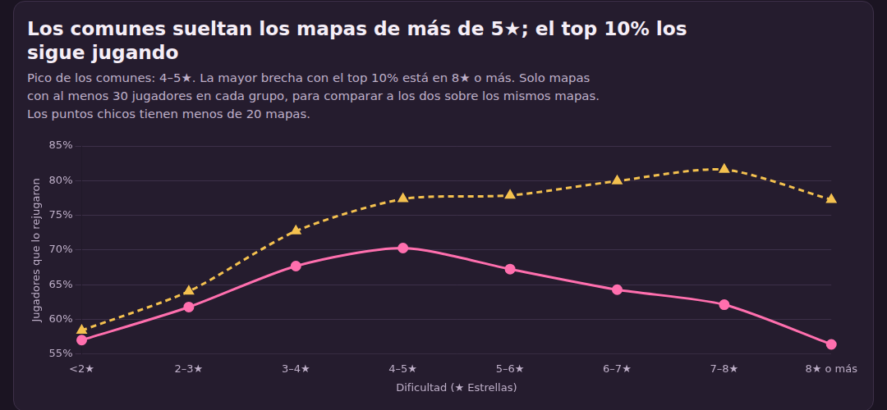

# Informe ejecutivo: ¿qué mapas de osu! hacen volver a los jugadores?

Iara Lourdes Bueno · Big Data Analytics · Septiembre 2026

📊 [Ver el dashboard interactivo](https://iarabueno.github.io/osu-rejuego-analisis/) · 📄 [Evidencia del proceso](../evidencia/evidencia_del_proceso.md)

---

## 1. Contexto y problema de negocio

**osu!** es un juego de ritmo: tocás círculos al ritmo de una canción. Cada canción jugable es un **mapa**, y su dificultad se mide en **estrellas (★)**.

El equipo que decide qué mapas entran al ranking oficial necesita saber **qué características de un mapa hacen que los jugadores comunes lo vuelvan a jugar**, para retener a ese público y no solo a los jugadores más activos.

| Término | Definición |
|---|---|
| Rejuego | El jugador jugó el mapa 2 veces o más. |
| Abandono | Lo jugó una sola vez. |
| Jugadores comunes | Toda la muestra menos el 10% más activo (1.000 jugadores con 13.494 jugadas o más), que se analizó aparte como comparación. |

Se siguió la metodología **CRISP-DM**. Las diferencias de menos de 2 puntos se consideran irrelevantes para decidir, aunque sean estadísticamente claras.

## 2. Fuente, calidad y preparación de los datos

**Fuente:** volcado oficial de la base de datos de osu! ([data.ppy.sh](https://data.ppy.sh), 1 de septiembre de 2026), modo estándar, muestra aleatoria de 10.000 jugadores activos.

| Etapa | Mapas |
|---|---:|
| Volcado completo | 235.046 |
| Solo modo estándar y mapas oficiales, sin duplicados ni nulos | 152.342 |
| Con al menos 30 jugadores comunes, para que cada tasa sea confiable | **17.521** |

- **Calidad:** no hay duplicados ni nulos en las columnas usadas, y todas las jugadas apuntan a mapas y jugadores existentes.
- **Valores extremos:** se conservaron porque son mapas reales (hasta 262★, maratones de 55 minutos). Se usaron medianas y rangos abiertos para que no distorsionen.
- **Validación humana:** recalculé en Excel la tasa de rejuego de un mapa puntual (77,1%) y la curva por estrellas en una muestra aleatoria de 500 mapas. Ambos coincidieron.

## 3. KPIs utilizados

| KPI | Cómo se calcula | Valor |
|---|---|---:|
| **Rejuego** | Jugadores comunes que jugaron el mapa 2 veces o más ÷ jugadores comunes que lo jugaron | **65,6%** |
| **Aprobación** | Pasadas ÷ intentos de cada mapa (dato global de osu!, no de la muestra) | **22,0%** (mediana) |
| **Concentración** | Jugadas de comunes que se lleva el 10% de mapas más populares | **71,9%** |

Las jugadas están muy sesgadas: un jugador común típico tiene 494 jugadas, pero el promedio es 5.466 porque unos pocos juegan muchísimo. Por eso se usaron medianas, percentiles e intervalos de confianza del 95% calculados remuestreando jugadores.

## 4. Hallazgos principales

**1. Los comunes sueltan los mapas difíciles; el top 10% no.**
El rejuego de los comunes sube de 55,5% en mapas de menos de 2★ a un pico de **69,8%** en 4–5★, y después baja hasta 56,3% en 8★ o más. En los mismos mapas, la brecha con el top 10% crece de 1,4 puntos (no concluyente) debajo de 2★ a **20,9 puntos** en 8★ o más.

**2. Los mapas cortos retienen más, aun a igual dificultad.**
Los mapas de menos de 1 minuto tienen 71,9% de rejuego, **4,8 puntos por encima** de lo esperable para sus estrellas. Otras características pesan poco o nada: el BPM no importa (Spearman 0,01), solo el anime supera el umbral de 2 puntos entre los géneros (+2,1), y los mapas *loved* quedan 2,5 puntos por debajo de los rankeados.

**3. 1.146 mapas son más difíciles de lo que dicen sus estrellas.**
Tienen rejuego alto (70,1% o más) pero una aprobación de 75% o menos de lo esperable para su dificultad. A igual cantidad de estrellas, duran más: 132 segundos de mediana contra 90.

## 5. Recomendaciones accionables

| | Recomendación |
|---|---|
| ⭐ **Cuidar** | Priorizar la oferta de mapas de 3 a 6★: reúnen el 70% de los mapas analizados y el 77% de las jugadas de los comunes en esos mapas. Los de más de 6★ conviene evaluarlos como contenido para el público más activo. |
| 🔍 **Revisar** | Chequear los 1.146 mapas candidatos, empezando por los más jugados, para ver si sus estrellas subestiman la dificultad real, sobre todo en mapas largos. |
| 🧪 **Probar** | Registrar jugadas con fecha para separar reintentos de regresos, y probar cambios acotados contra un grupo de control. No usar BPM ni favoritos como criterio. |

## 6. Limitaciones, sesgos y riesgos

- **Reintentos:** el rejuego incluye reiniciar un mapa, no solo volver días después. Sin fechas no se pueden separar.
- **Datos globales:** la aprobación y los favoritos son de todos los jugadores de osu!, no de la muestra.
- **Solo activos:** la muestra no incluye a quienes dejaron de jugar, ni jugadas en mapas no oficiales.
- **Correlación:** los resultados muestran asociaciones, no prueban que un cambio cause más rejuego.
- **Grupos chicos:** algunos géneros y los mapas de 8★ o más tienen pocos casos, y sus resultados son poco confiables.
- **Vigencia:** es una foto de septiembre de 2026 y no se actualiza sola.
