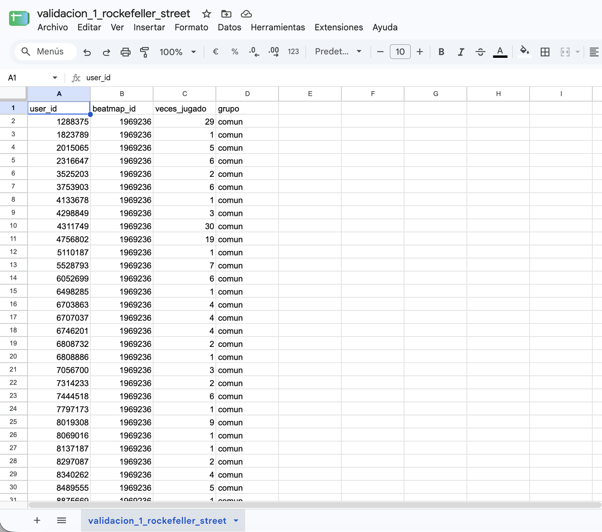
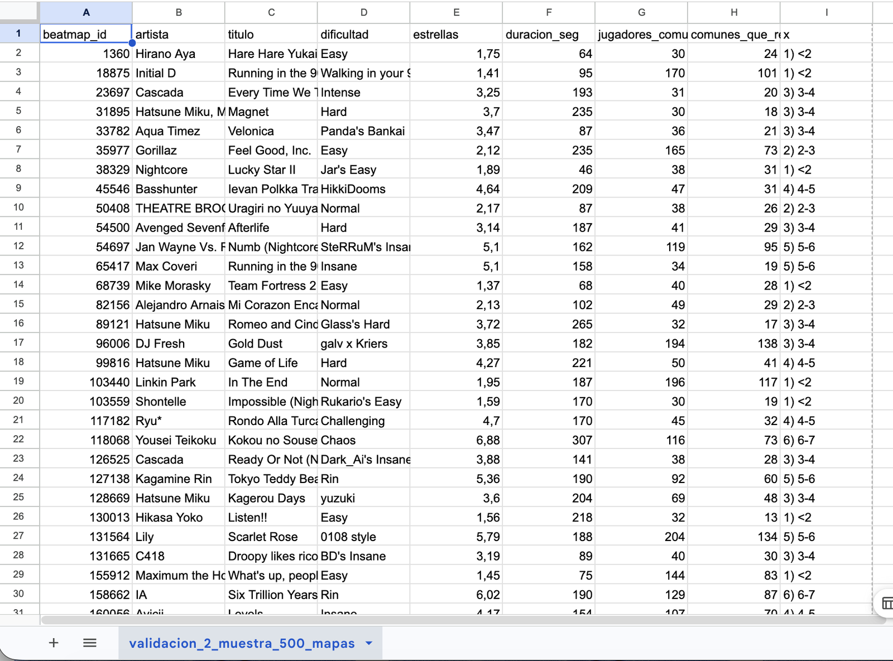
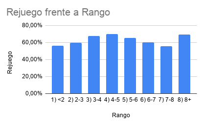

# Validación humana

Para no depender solo de los resultados de la IA, recalculé por mi cuenta dos resultados clave en una planilla de cálculo, a partir de archivos exportados del análisis. Las dos validaciones coincidieron con los valores del análisis.

| Archivo | Qué valida |
|---|---|
| [`validacion_1_rockefeller_street.xlsx`](validacion_1_rockefeller_street.xlsx) | Un número exacto: la tasa de rejuego de un mapa puntual |
| [`validacion_2_muestra_500_mapas.xlsx`](validacion_2_muestra_500_mapas.xlsx) | Un patrón: la curva de rejuego por dificultad (U invertida) |

---

## Validación 1: tasa de rejuego de un mapa puntual

**Mapa:** Getter Jaani – Rockefeller Street (Nightcore Mix) [Lasse's Insane].

**Datos:** 880 filas, una por jugador que jugó el mapa, con cuatro columnas: `user_id`, `beatmap_id`, `veces_jugado` y `grupo` (`comun` o `top10`).



**Fórmulas usadas:**

| Cálculo | Fórmula |
|---|---|
| Jugadores comunes | `=CONTAR.SI(D:D;"comun")` |
| Comunes que lo rejugaron | `=CONTAR.SI.CONJUNTO(D:D;"comun";C:C;">=2")` |
| Tasa de rejuego de comunes | rejugaron ÷ jugadores comunes |
| Top 10% que lo rejugó | `=CONTAR.SI.CONJUNTO(D:D;"top10";C:C;">=2")` |
| Tasa de rejuego del top 10% | rejugaron ÷ `=CONTAR.SI(D:D;"top10")` |

**Resultado:**

| Cálculo | Planilla | Análisis | ¿Coincide? |
|---|---:|---:|:---:|
| Jugadores comunes | 475 | 475 | ✅ |
| Comunes que lo rejugaron | 366 | 366 | ✅ |
| Tasa de rejuego de comunes | 77,05% | 77,1% | ✅ |
| Top 10% que lo rejugó | 311 de 405 | 311 de 405 | ✅ |
| Tasa de rejuego del top 10% | 76,79% | 76,8% | ✅ |

---

## Validación 2: curva de rejuego por dificultad

**Datos:** muestra aleatoria de 500 mapas (semilla fija 2026) tomada de los 17.520 mapas con al menos 30 jugadores comunes y franja de estrellas. Columnas: `beatmap_id`, `artista`, `titulo`, `dificultad`, `estrellas`, `duracion_seg`, `jugadores_comunes` y `comunes_que_rejugaron`.



**Paso 1: franja de estrellas de cada mapa (columna I).**

```
=SI(E2<2;"1) <2";SI(E2<3;"2) 2-3";SI(E2<4;"3) 3-4";SI(E2<5;"4) 4-5";SI(E2<6;"5) 5-6";SI(E2<7;"6) 6-7";SI(E2<8;"7) 7-8";"8) 8+")))))))
```

**Paso 2: tabla resumen por franja.**

| Columna | Fórmula |
|---|---|
| Mapas por franja | `=CONTAR.SI(I:I;K2)` |
| Rejuego agregado | `=SUMAR.SI(I:I;K2;H:H)/SUMAR.SI(I:I;K2;G:G)` |

El rejuego agregado es la suma de jugadores que rejugaron dividida por la suma de jugadores de la franja. No es el promedio de las tasas de cada mapa.

**Resultado:**

| Franja | Mapas | Rejuego (planilla) | Datos completos (17.520 mapas) |
|---|---:|---:|---:|
| <2★ | 29 | 56,1% | 55,5% |
| 2–3★ | 83 | 59,5% | 60,6% |
| 3–4★ | 112 | 67,7% | 66,8% |
| 4–5★ | 126 | **70,1%** | **69,8%** |
| 5–6★ | 116 | 65,6% | 67,2% |
| 6–7★ | 28 | 60,0% | 64,2% |
| 7–8★ | 3 | 55,7% | 62,1% |
| 8★ o más | 3 | 69,1% | 56,3% |



**Conclusión:** la muestra reproduce la U invertida con el pico en 4–5★, igual que los datos completos. Las franjas de 7–8★ y de 8★ o más tienen solo 3 mapas cada una, así que un solo mapa alcanza para mover el resultado: no son concluyentes. Validar con una muestra de 500 mapas funciona para el centro de la curva, pero no para los extremos.

---

## Qué detectó la revisión humana

Además de estos recálculos, revisar los números entre etapas permitió detectar cosas que el análisis no había informado:

- **Un mapa excluido sin aviso:** la muestra salía de 17.520 mapas y no de 17.521. Era un mapa de 0★ que el análisis había sacado de las franjas de dificultad.
- **Un KPI contradictorio:** la tarjeta de concentración del dashboard mostraba 48,6%, un valor que el propio análisis había descartado; se corrigió a 71,9%.
- **Números sin validar:** dos porcentajes del informe (70% de mapas y 77% de jugadas) no habían pasado por validación; se verificó que cierran con los totales ya validados.

El detalle completo está en la [evidencia del proceso](../evidencia/evidencia_del_proceso.md).
